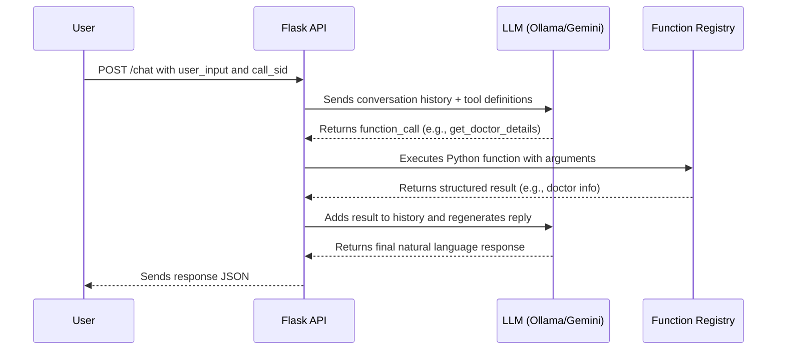

# 🧠 LLM Function Calling Backend – Doctor & Hospital Info Assistant

This project implements the **LLM-based function calling backend** for a conversational assistant that provides hospital and doctor-related information. It supports **two pluggable architectures**: one using a **local LLM via Ollama**, and the other using **Google’s hosted Gemini 2.0 Flash** model.

This focuses purely on the **LLM orchestration and function execution**, which can later be integrated with voice pipelines (e.g., Twilio or Deepgram).

---

## 🔀 Approaches Included

### 🔹 1. **Local LLM (LLaMA3.2 via Ollama)**
- Runs completely offline using `ollama` and `llama3.2` model.
- Handles structured tool/function calls using Ollama's API.

### 🔹 2. **Cloud LLM (Google Gemini 2.0 Flash)**
- Uses `google-generativeai` SDK to access Gemini models with function calling support.
- Functions are exposed via Google’s structured tools interface.

---

## ✅ Core Features

- **LLM-Driven Function Calling**: Dynamically calls backend Python functions based on natural language queries.
- **Domain-Specific Knowledge**: Functions return structured details like doctor schedules, hospital timings, and addresses.
- **Session Memory**: Maintains per-user message history (`call_sid`) for continuity.
- **Retry Handling**: Retries function calls upon failures using configurable logic.
- **Model Agnostic**: Easily switch between Ollama or Gemini backends.
- **Modular Flask APIs**: Simple REST interfaces to integrate into voice/chat applications.

---

## Project Structure

├── app.py # Ollama-based function-calling server 
├── gemini_llm_approach.py # Gemini-based function-calling server 
├── requirements.txt 
└── README.md

---

## Setup Instructions

### 1️⃣ Prerequisites

- Python 3.8+
- For **Ollama**:
  - [Ollama installed](https://ollama.com/download)
  - `llama3.2` model pulled via `ollama pull llama3:2`
- For **Gemini**:
  - Get a [Google API key](https://makersuite.google.com/app/apikey)

---

### 2️⃣ Install Dependencies

```bash
pip install -r requirements.txt
```

### 3️⃣ Running the Flask Server

▶️ For Local Ollama (LLaMA3.2)

```bash
python app.py
```
Make sure ollama is running in the background.

▶️ For Google Gemini

```bash
export GEMINI_API_KEY=your-key-here
python gemini_llm_approach.py
```

## Example API Usage

Endpoint: POST /chat
Headers: Content-Type: application/json
Payload:

{
  "call_sid": "user-001",
  "user_input": "Can you tell me about Dr. Jane Smith?"
}
Response:

{
  "response": "Dr. Jane Smith is a Heart Surgery specialist in the Cardiology department. She is available on Monday, Wednesday, and Friday from 10:00 am to 12:00 pm."
}

## Available Functions

Function Name -> Description
get_doctor_details -> Fetches department, specialization, and timings
get_hospital_address -> Provides full address of the hospital
get_hospital_timings -> Returns weekly operating hours

## Environment Variables

Variable -> Description
GEMINI_API_KEY -> (Required for Gemini approach to call Gemini API)


## Example Use Cases
- Build a hospital FAQ chatbot for websites or kiosks.
- Integrate this backend with Twilio to build a full IVR system.
- Extend it to support appointment booking or real-time patient info.

## NOTE:
This project can be used along with the Twilio IVR project in this link :- 
https://github.com/AshwinVagu/MIE_NATIVE_TWILIO_IVR

## Workflow for this function calling:



